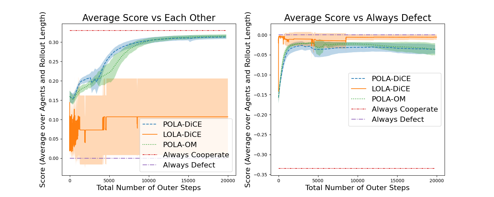
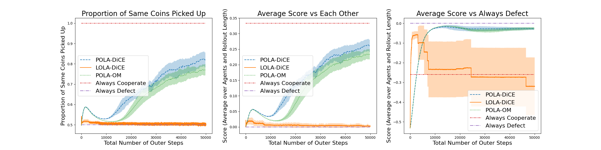

# Proximal Learning with Opponent Learning Awareness (POLA)

Hello! Welcome to the code for POLA. Hope you are having a good day (and hopefully this codebase doesn't ruin that haha). 

For the plots (Figures 4 and 5), the workflow is to run the commands, then paste the checkpoint names into the result_plots.py file (in the code, now in the jax_files folder), then run result_plots.py. Figures 1 and 3 were generated by hand using the output from the commands.

## Dependencies you may need:

higher (for LOLA_exact.py) (https://github.com/facebookresearch/higher)

flax (if using the JAX files, which I strongly recommend for LOLA-DiCE and POLA-DiCE experiments. The JAX files are faster at least 2x, and more so with more inner steps; they also have what I consider to be a better implementation of KL divergence for use in POLA based on new rollouts, and are used in the paper for Figures 4 and 5)

## Commands used for Figure 1 (Opening Graphic)

Init state representation 2 means the start state is different from the other states (0 = defect, 1 = cooperate)

### LOLA:

Neural Net 1:

python LOLA_exact.py --n_agents 2 --using_nn --nn_hidden_size 2 --custom_param 1 --print_every 1 --repeats 1 --num_epochs 1 --init_state_representation 2  --set_seed --seed 1 --lr_policies_inner 0.2 --lr_policies_outer .05 --actual_update --base_cf_no_scale 1.33

Neural Net 2:

python LOLA_exact.py --n_agents 2 --using_nn --nn_hidden_size 2 --custom_param 4 --print_every 1 --repeats 1 --num_epochs 1 --init_state_representation 2  --set_seed --seed 1 --lr_policies_inner 0.2 --lr_policies_outer .05 --actual_update --base_cf_no_scale 1.33

### POLA:

Neural Net 1:

python LOLA_exact.py --n_agents 2 --using_nn --nn_hidden_size 2 --custom_param 1 --print_every 1 --repeats 1 --num_epochs 1 --init_state_representation 2 --set_seed --seed 1 --lr_policies_inner 0.2 --lr_policies_outer .005 --actual_update --base_cf_no_scale 1.33 --outer_exact_prox --outer_beta 5 --print_prox_loops_info

Neural Net 2:

python LOLA_exact.py --n_agents 2 --using_nn --nn_hidden_size 2 --custom_param 4 --print_every 1 --repeats 1 --num_epochs 1 --init_state_representation 2 --set_seed --seed 1 --lr_policies_inner 0.2 --lr_policies_outer .005 --actual_update --base_cf_no_scale 1.33 --outer_exact_prox --outer_beta 5 --print_prox_loops_info

## Commands used for Figure 3 (IPD with Exact Value Function)

Init state representation 2 means the start state is different from the other states (0 = defect, 1 = cooperate)

### LOLA Tabular

CF=1.1-1.6

python LOLA_exact.py --n_agents 2 --print_every 10 --repeats 20 --num_epochs 30 --init_state_representation 2 --set_seed --seed 1 --lr_policies_inner 3 --lr_policies_outer 25 --actual_update --base_cf_no_scale 1.1

The above set of commands works with only changing --base_cf_no_scale. Of course you can use smaller learning rates for higher CF and that will work fine too.

### LOLA Func Approx

Could not get CF 1.25 or below finding TFT with probability > 0.

CF=1.33

python LOLA_exact.py --n_agents 2 --using_nn --nn_hidden_size 16 --print_every 20 --repeats 20 --num_epochs 100 --init_state_representation 2  --set_seed --seed 1 --lr_policies_inner 0.4 --lr_policies_outer 0.05 --actual_update --base_cf_no_scale 1.33

CF=1.4

python LOLA_exact.py --n_agents 2 --using_nn --nn_hidden_size 16 --print_every 20 --repeats 20 --num_epochs 100 --init_state_representation 2 --set_seed --seed 1 --lr_policies_inner 0.3 --lr_policies_outer 0.1 --actual_update --base_cf_no_scale 1.4

CF=1.6

python LOLA_exact.py --n_agents 2 --using_nn --nn_hidden_size 16 --print_every 20 --repeats 20 --num_epochs 100 --init_state_representation 2 --set_seed --seed 1 --lr_policies_inner 0.12 --lr_policies_outer 0.05 --actual_update --base_cf_no_scale 1.6

### LOLA Pre-Conditioned Tabular

Could not get anything finding TFT at all.

### (Outer) POLA Tabular

CF=1.1-1.33

python LOLA_exact.py --n_agents 2 --print_every 1 --repeats 20 --num_epochs 2 --init_state_representation 2 --set_seed --seed 1 --lr_policies_inner 5 --lr_policies_outer 0.3 --outer_exact_prox --outer_beta 0.1 --actual_update --base_cf_no_scale 1.1

python LOLA_exact.py --n_agents 2 --print_every 1 --repeats 20 --num_epochs 2 --init_state_representation 2 --set_seed --seed 1 --lr_policies_inner 5 --lr_policies_outer 0.3 --outer_exact_prox --outer_beta 0.1 --actual_update --base_cf_no_scale 1.25

python LOLA_exact.py --n_agents 2 --print_every 1 --repeats 20 --num_epochs 2 --init_state_representation 2 --set_seed --seed 1 --lr_policies_inner 5 --lr_policies_outer 0.3 --outer_exact_prox --outer_beta 0.1 --actual_update --base_cf_no_scale 1.33

CF=1.4

python LOLA_exact.py --n_agents 2 --print_every 1 --repeats 20 --num_epochs 2 --init_state_representation 2 --set_seed --seed 1 --lr_policies_inner 4 --lr_policies_outer 0.3 --outer_exact_prox --outer_beta 0.1 --actual_update --base_cf_no_scale 1.4

CF=1.6

python LOLA_exact.py --n_agents 2 --print_every 1 --repeats 20 --num_epochs 2 --init_state_representation 2 --set_seed --seed 1 --lr_policies_inner 2.5 --lr_policies_outer 0.3 --outer_exact_prox --outer_beta 0.1 --actual_update --base_cf_no_scale 1.6

### (Outer) POLA Func Approx

CF=1.1

python LOLA_exact.py --n_agents 2 --using_nn --print_every 1 --repeats 20 --num_epochs 2 --init_state_representation 2 --set_seed --seed 1 --lr_policies_inner 0.3 --lr_policies_outer 0.03 --outer_exact_prox --outer_beta 0.1 --actual_update --base_cf_no_scale 1.1

CF=1.25

python LOLA_exact.py --n_agents 2 --using_nn --print_every 1 --repeats 20 --num_epochs 2 --init_state_representation 2 --set_seed --seed 1 --lr_policies_inner 0.25 --lr_policies_outer 0.03 --outer_exact_prox --outer_beta 0.13 --actual_update --base_cf_no_scale 1.25

CF=1.33

python LOLA_exact.py --n_agents 2 --using_nn --print_every 1 --repeats 20 --num_epochs 2 --init_state_representation 2 --set_seed --seed 1 --lr_policies_inner 0.25 --lr_policies_outer 0.02 --outer_exact_prox --outer_beta 0.13 --actual_update --base_cf_no_scale 1.33

CF=1.4

python LOLA_exact.py --n_agents 2 --using_nn --print_every 1 --repeats 20 --num_epochs 2 --init_state_representation 2 --set_seed --seed 1 --lr_policies_inner 0.2 --lr_policies_outer 0.03 --outer_exact_prox --outer_beta 0.1 --actual_update --base_cf_no_scale 1.4

CF=1.6

python LOLA_exact.py --n_agents 2 --using_nn --print_every 1 --repeats 20 --num_epochs 2 --init_state_representation 2 --set_seed --seed 1 --lr_policies_inner 0.12 --lr_policies_outer 0.03 --outer_exact_prox --outer_beta 0.05 --actual_update --base_cf_no_scale 1.6

### (Outer) POLA Pre-Conditioned Tabular

CF=1.1

python LOLA_exact.py --n_agents 2 --ill_condition --print_every 5 --repeats 20 --num_epochs 10 --init_state_representation 2 --set_seed --seed 2 --lr_policies_inner 0.4 --lr_policies_outer 0.05 --outer_exact_prox --outer_beta 0.5 --actual_update --base_cf_no_scale 1.1

CF=1.25

python LOLA_exact.py --n_agents 2 --ill_condition --print_every 5 --repeats 20 --num_epochs 10 --init_state_representation 2 --set_seed --seed 2 --lr_policies_inner 0.5 --lr_policies_outer 0.05 --outer_exact_prox --outer_beta 0.5 --actual_update --base_cf_no_scale 1.25

CF=1.33

python LOLA_exact.py --n_agents 2 --ill_condition --print_every 5 --repeats 20 --num_epochs 10 --init_state_representation 2 --set_seed --seed 2 --lr_policies_inner 0.4 --lr_policies_outer 0.05 --outer_exact_prox --outer_beta 0.5 --actual_update --base_cf_no_scale 1.33

CF=1.4

python LOLA_exact.py --n_agents 2 --ill_condition --print_every 5 --repeats 20 --num_epochs 10 --init_state_representation 2 --set_seed --seed 2 --lr_policies_inner 0.3 --lr_policies_outer 0.05 --outer_exact_prox --outer_beta 0.5 --actual_update --base_cf_no_scale 1.4

CF=1.6

python LOLA_exact.py --n_agents 2 --ill_condition --print_every 5 --repeats 20 --num_epochs 10 --init_state_representation 2 --set_seed --seed 2 --lr_policies_inner 0.3 --lr_policies_outer 0.05 --outer_exact_prox --outer_beta 0.5 --actual_update --base_cf_no_scale 1.6

## Commands for additional experiments with varying parameterizations of the opponent model (Appendix B.1.6)

### LOLA Tabular

python LOLA_exact.py --n_agents 2 --print_every 10 --repeats 10 --num_epochs 50 --init_state_representation 2 --set_seed --seed 1 --lr_policies_inner 3 --lr_policies_outer 1 --actual_update --base_cf_no_scale 1.33 --inner_steps 1  --outer_steps 1  --opp_model --om_exact --om_lr_p .2

### LOLA Func Approx

python LOLA_exact.py --n_agents 2 --print_every 10 --repeats 10 --num_epochs 50 --init_state_representation 2 --set_seed --seed 1 --lr_policies_inner 0.2 --lr_policies_outer 1 --actual_update --base_cf_no_scale 1.33 --inner_steps 1  --outer_steps 1  --opp_model --om_exact --om_using_nn --om_lr_p .2

### LOLA Pre-Conditioned Tabular

python LOLA_exact.py --n_agents 2 --print_every 10 --repeats 10 --num_epochs 50 --init_state_representation 2 --set_seed --seed 1 --lr_policies_inner 1 --lr_policies_outer 1 --actual_update --base_cf_no_scale 1.33 --inner_steps 1  --outer_steps 1  --opp_model --om_exact --om_precond --om_lr_p .2

### POLA Tabular

python LOLA_exact.py --n_agents 2 --print_every 10 --repeats 10 --num_epochs 50 --init_state_representation 2 --set_seed --seed 1 --lr_policies_inner .2 --lr_policies_outer 1 --actual_update --base_cf_no_scale 1.33 --inner_steps 100 --inner_beta 3 --outer_steps 1  --opp_model --om_exact --om_lr_p .2

### POLA Func Approx

python LOLA_exact.py --n_agents 2 --print_every 10 --repeats 10 --num_epochs 50 --init_state_representation 2 --set_seed --seed 1 --lr_policies_inner .05 --lr_policies_outer 1 --actual_update --base_cf_no_scale 1.33 --inner_steps 100 --inner_beta 3 --outer_steps 1  --opp_model --om_exact --om_using_nn --om_lr_p .2

### POLA Pre-Conditioned Tabular

python LOLA_exact.py --n_agents 2 --print_every 10 --repeats 10 --num_epochs 50 --init_state_representation 2 --set_seed --seed 1 --lr_policies_inner .15 --lr_policies_outer 1 --actual_update --base_cf_no_scale 1.33 --inner_steps 200 --inner_beta 3 --outer_steps 1  --opp_model --om_exact --om_precond --om_lr_p .2

## Commands used for Figure 4 (IPD with full history)

Updated figure below (after bug fixes; see discussion under Issues). POLA results are comparable to (slightly better) than in the paper. LOLA-DiCE was unaffected.

Change the --seed parameter for different seeds.

### LOLA-DiCE

python ./jax_files/POLA_dice_jax.py --env ipd  --n_update 20001 --gae_lambda 1.0  --inner_steps 1 --outer_steps 1 --lr_in 0.05 --lr_out 0.003 --lr_v 0.0005 --batch_size 2000 --rollout_len 50  --print_every 10 --outer_beta 0 --inner_beta 0 --seed 6 --layers_before_gru 1 --save_dir --checkpoint_every 1000 --hidden_size 64 --contrib_factor 1.33

### POLA-DiCE 

python ./jax_files/POLA_dice_jax.py --env ipd  --n_update 101 --gae_lambda 1.0  --inner_steps 2 --outer_steps 200 --lr_in 0.005 --lr_out 0.003 --lr_v 0.0005 --batch_size 2000 --rollout_len 50  --print_every 1 --inner_beta 10 --outer_beta 100 --seed 1 --layers_before_gru 1 --checkpoint_every 10 --hidden_size 64

### POLA-OM 

python ./jax_files/POLA_dice_jax.py --env ipd  --n_update 101 --gae_lambda 1.0  --inner_steps 2 --outer_steps 200 --lr_in 0.005 --lr_out 0.003 --lr_v 0.0005 --batch_size 2000 --rollout_len 50  --print_every 1 --inner_beta 10 --outer_beta 100 --seed 10 --layers_before_gru 1 --checkpoint_every 10 --hidden_size 64 --opp_model --opp_model_steps 1 --opp_model_data_batches 200 --om_lr_p 0.005 --om_lr_v 0.0005

## Commands used for Figure 5 (coin game)

Updated figure below (after bug fixes; see discussion under Issues). POLA-DiCE results are comparable to the paper, while POLA-OM results are better. LOLA-DiCE was unaffected.

Change the --seed parameter for different seeds.

### LOLA-DiCE

python ./jax_files/POLA_dice_jax.py --env coin --n_update 50001 --gae_lambda 1.0  --inner_steps 1 --outer_steps 1 --lr_in 0.003 --lr_out 0.003 --lr_v 0.0005 --batch_size 2000 --rollout_len 50  --print_every 10 --outer_beta 0 --inner_beta 0 --seed 1 --layers_before_gru 1 --checkpoint_every 2000 --hidden_size 64

### POLA-DiCE (Edited: July 3, 2023)

python ./jax_files/POLA_dice_jax.py --env coin --n_update 251 --gae_lambda 1.0 --inner_steps 4 --outer_steps 200 --lr_in 0.01 --lr_out 0.003 --lr_v 0.0005 --batch_size 1000 --rollout_len 50 --print_every 1 --outer_beta 150 --inner_beta 5 --layers_before_gru 1 --checkpoint_every 25 --hidden_size 64 --seed 7

### POLA-OM (Edited: July 3, 2023)

python ./jax_files/POLA_dice_jax.py --env coin --n_update 251 --gae_lambda 1.0 --inner_steps 6 --outer_steps 200 --lr_in 0.01 --lr_out 0.003 --lr_v 0.0005 --batch_size 1000 --rollout_len 50 --print_every 1 --outer_beta 150 --inner_beta 15 --seed 7 --layers_before_gru 1 --checkpoint_every 25 --hidden_size 64 --opp_model --opp_model_steps 1 --opp_model_data_batches 200 --om_lr_p 0.005 --om_lr_v 0.0005
